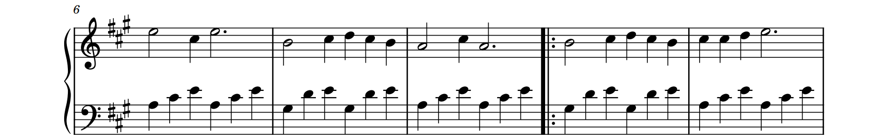

import C from '@site/src/mdx'

# 更复杂的音高 {#complicated-notes}

很高兴你坚持到了这里，这说明你对基础乐理确实是有一定了解的。

在本节中，我们将介绍更复杂的音高写法，主要包括上下八度、升降音和节奏记号。

## tl;dr {#tldr}

- 在音符数字后紧跟 `e` 或 `d`，表示高八度或低八度。可以叠加。
- 在音符数字前添加 `#` `b` 或 `=`，分别表示升调、降调和还原。
- 用 `X` 代替音符数字即可写出节奏记号 X。
- `8` `9` `Y` `Z` `_` 也可以用作音符数字，含义没有明确说法。
- 在音乐属性中使用形如 `1=#C` `1=C5` `1=bE4` 的形式指定基调。
- 像升降记号那样，前缀字符 `$` 表示“半升”，前缀字符 `%` 表示“半降”。它们基于 24 平均律的假设。

## 基本音高记号 {#basic-pitching}

之前我们看到，用数字 `1` ~`7` 就可以表示音高，并且，还可以进行一些修饰。

### 上下八度 {#octave}

在音符数字后面紧跟 `e` 和 `d`，就可以分别实现在音符上方和下方加点。现在，尝试一下这个简单的旋律：

<C.RealtimeScore efRange={[1,5]} noCode children={
`P: 1=C 4/4
---
// highlight-next-line
N: 5d~ - - - | 5d - - - | 1e - 1 - | 1e - 1 - | 1e - 1 - | 1e - 1 - | 1e - 1e - | 2e - 1e - |
`
} />

非常简单轻松愉快的事情，对吧？

<C.ScoreExample canLoad children={
`P: 1=C 4/4
---
// highlight-next-line
N: 5d~ - - - | 5d - - - | 1e - 1 - | 1e - 1 - | 1e - 1 - | 1e - 1 - | 1e - 1e - | 2e - 1e - |
`
} />

上下加点也是可以叠加的，这样可以表示上两个或下两个八度。例如：

<C.RealtimeScore efRange={1} children={
`// preserve-start
P: 1=C 4/4
---
// highlight-next-line
N: (13)(51e)(5e3e)(1e5) | (24)(62e)(4e2e)(64) | (35)(73e)(7e5e)(3e7) | (61e)(4e6e)(1ee6e)(4e1e) |
// preserve-end
A: 0 | 0 | 0 | 0 0 "↓Here"
`
} />

不过你不能让一个音符同时有上下加点。事实上，这样写会抵消。

:::caution 常见错误

简谱中，记谱时漏掉一些上下加点是非常常见并且有时难以避免的错误，因此强烈建议在印刷或发布乐谱前通过音效试听检查。

:::

### 升降调 {#accidental}

数字 `1`~`7` 只能表示 12 平均律中的 7 个音，关系如下：

| 相对音调/*Key | 0 | 1 | 2 | 3 | 4 | 5 | 6 | 7 | 8 | 9 | 10 | 11 | (0) |
|-|-|-|-|-|-|-|-|-|-|-|-|-|-|
| 数字 | 1 | | 2 | | 3 | 4 | | 5 | | 6 | | 7 | (1e) |

这就是我们平时记忆的自然音序列“全-全-半-全-全-全-半”或“0-2-4-5-7-9-11”。表示夹缝中的音，需要用长得很像 `#` 的升调记号或者很像 `b` 的降调记号，表示将音高升高或降低 1Key。

在 Sparks NMN 中，使用符号 `#` 和 `b` 即可，写在**音符的数字前面**。

<C.RealtimeScore efRange={1} children={
`P: 1=C 4/4
---
// highlight-next-line
N: 3. (3)(32) 1 | (2) #4 (2) 2 - | 2. (2) (21) (35) | b7 - - -|
`
} />

升降调记号可以叠加，但是如果你的乐谱中需要这种东西，说明你的基调（也称“首调”）选错了，你应该换一个基调（或者说换一组唱名来描述）。如果你不理解简谱的基调规则，请继续阅读，下文会提到如何理解相对音高体系。

升调记号和降调记号不能叠加，如果强行叠加，会变成还原记号。

另外，考虑到你可能对乐谱中升降号的使用规则不了解，补充以下两点。

#### 升降调的作用域 {#accidental-scope}

升降调记号作用于某个数字后，在该小节内会被“记住”，并自动地作用于之后相同的数字上，直到这一小节结束。看这个例子：

<C.RealtimeScore efRange={1} children={
`// preserve-start
P: 1=C 4/4
---
// highlight-next-line
N: ((6543)) (23) (#5. (3)) 5 | ((5432)) ((3212)) (3.(1)) 3 |((6543)) ((#5#434)) 5 7 | ((6543)) ((3#5)7) 6 - |
// preserve-end
A: ((00"A"0)) 0 "B" "C" | "D"
`
} />

- B 音符 `5` 上出现了升调记号。
- A 音符在 B 之前，不受升调记号影响。
- C 音符在 B 之后且没有标注记号，也需要进行升调。
- D 音符和 B 不在同一小节，自然不受影响，即使不加注还原记号。

要将小节中已经被升调或降调的数字还原，应当使用还原记号。还原记号写作 `=`。

<C.RealtimeScore efRange={1} children={
`// preserve-start
P: 1=C 4/4
---
// highlight-next-line
N: ((3#4#56)) (7=4) ((3)2(3)) 4 | ((2345)) (62) (34) 3 | ((2345)) ((67)1e) ((76#56)) 7 | ((7654)) (3#5) 6 - |
// preserve-end
A: ((0"A"00))(0"B") 0 "C" | 0 | 0 0 ((00"D")) 0 | ((00"E"0))(0"F") |
`
} />

- A 音符 `4` 使用了升调记号。
- B 音符本应当同样使用升调记号，但是被还原，因此不进行升降调。
- 还原记号也会被“记住”并覆盖之前的升调记号，因此音符 C 不进行升降调。
- E 音符和 D 不在同一小节，并且在 F 之前，故不进行升降调。

#### 标注额外的还原记号 {#unexpected-restore}

我们知道，如果不升降的音符已经超出了原来升降记号的作用范围，则不需要加注还原记号。但是，有时候这可能会导致读者误认为“打错了”。比如来自歌曲[《枕边童话》](https://www.kuwo.cn/play_detail/153791751)的这个例子：

<C.RealtimeScore efRange={[18,22]} children={
`Dt: 枕边童话
Da[作词]: 唐思淼
Da[作曲]: 爱写歌的小田
P: 1=C 6/8 spm=140
Rp: font_lyrics=Roman,CommonSerif/600/0.95
====
Frp: n=5
N: - - &lpr; (06d) | (6d(6d7d)(16d)) (654) | (3. (4)(32)) 1 (5d) | 6d (3) 2 (3) | 6d - - &rpr; |
---
N: ||: ((32)(32)(31)) 2 (0) | ((32)(32)(37d)) 1(0) | (6d(6d7d)1)(121) | (235) 3 (0) |
Lc: 枕头下的童话书，私自收藏的幸福，少年的我想倾诉什么感触。
---
N: ((32)(32)(31)) 2 (0) | ((32)(32)(37d)) 1 (0) | (6d13) 2 (3) | 6d. 0 ((34)) |
Lc: 迷失森林的小鹿，会不会遇到女巫，故事拉开序幕。 星光
---
N: (4(43)(46)) (65.(5)) | (6(65)(67)) (1e7.(2)) | 3 ((32)) (342) | 3. 0 ((23)) |
Lc: 拨开最神秘的雾，踮起脚尖旋转舞步，恍恍惚惚听谁在哭。 月光
---
// preserve-start
N: (4(43)(46)) (65.(5)) | (6(65)(67)) (1e7.(3)) | 4 (4) (461e) | 7~. (7(03)(#23)) |
Lc: 叮嘱窗外的植物，遇到孩子记得让路，谁会救赎我孤独。你是那
---
// highlight-next-line
N: ||:{3.} (66(61e)) (1e75) | (523) (6.(3)(=23)) | (44(43)) (41e7) | (756) (3.(3)(33)) |
Lc: 童话里的公主站在光明处，我戴上华丽假面转身躲进黑礼服。请和我
// preserve-end
---
N: (6 6(61e))(1e75) | (523)6(3) | (441e)(7)1e |
Lc: 起舞趁着童话还没有结束，天亮后让一切
---
J: 1., *
N: 7 (6~) 6. |
Lc: 恢复。
---
J: 1.
N: &lpr;(6d(6d1)(6d7d))(17d6d) | (5d(5d6d)(5d2d))3d. | (6d(6d1)(6d7d))(124) | (3.(2)(34))3. |
---
J: 1.
N: 6. (5.(6)(53)) | (234) 3. | 2. (1.(2)(17d)) | 6d - - &rpr; :||
---
J: 2.
N: 7 (6~) (6. &cas; (3)(#23)) :||
Lc: 恢复。你是那
---
J: 3., "结束句"
N: 7 (6~) 6. |
Lc: 恢复。
---
J: 3., "结束句"
N: &lpr; 6. (71e2e) | 3e (4e)3e. | (2e.(3e)2e)(1e.(2e)7) | 6 - - &rpr; |||
`
} />

第 21 小节中的音符 `2` 加注了升调记号，而第 23 小节同样位置的 `2` 不需要升调。但是，这两处的结构实在过于相近，如果第 23 小节处没有任何记号，读者可能会误认为是乐谱编辑者漏掉了。为了防止这种情况，在这里加上还原记号以示强调。

#### 升降调与转调 {#accidental-and-shifting}

如果乐谱某一处之后你发现升降调记号出现得非常频繁，甚至有不少于两种数字永远都带升降号，你应当考虑这里是否发生了转调。如果是这样，应该用转调的记法，而非使用原来的基调继续记谱。后面的[转调](/docs/tutorial-basics/musical-variation#shift)章节将介绍如何使用转调记法。

### 节奏记号 {#rhyme-notation}

有的情况下乐谱中只需要节奏而不需要音高。这种情况可能是打击乐，可能是念白，可能是说唱，也可能是在一份名为“基础节奏练习”的乐谱中。这种情况下，我们一般用大写字母 `X` 来代替音符数字，在简谱的写法中是如此，在 Sparks NMN 语法中也是如此。

<C.RealtimeScore efRange={1} children={
`P: 1=C 4/4
---
// highlight-next-line
N: X X X X | X (XX) X X | X (XX) ((XX)X) X | X ((X)X(X)) ((XX)X) X |
`
} />

:::info 提示

你会发现 `X` 也可以被添加上下加点和升降记号。它们表示什么没有确切的说法，请自行发挥。不过，不要忘了为你的读者[加上文字说明](/docs/tutorial-annotation/annotations)！

:::

### 其他音符符号 {#other-note-symbols}

除了上面的数字 `1`~`7` 和字母 `X` 外，还有五个符号也可以表示音符，即 `8` `9` `Y` `Z` `_`。

<C.RealtimeScore noCode efRange={1}  children={
`P: 1=? 0/4
Rp: sectionorder=none n=1
N: 0 1 2 3 4 5 6 7 8 9 X Y Z _
`
} />

它们的意义没有确切说法，但是万一你想整什么花活呢？

## 理解相对音高体系 {#deep-into-relative-pitch}

与五线谱不同，简谱对音高的记号不是基于绝对的音高数值，而是基于歌曲的调性。我们知道，国际约定 `A4` 表示 440Hz，但是在简谱中，`6` 所代表的则很可能不是 440Hz，`1` 也很可能不是对应 `C4`。

简谱并非首创于中国。早在西方启蒙运动时期，就有人倡议使用这种方式记谱，就像我们倡议使用白话文一样。如今，在我国流行音乐中，基于相对音高的简谱比较常用。原因有二：

- 在革命时期，文化宣传的力量是非常重要的，一些革命歌曲的创作和传唱对革命而言功不可没。为了促进这些歌曲的传播，我们需要一种比五线谱更加简单、更加自然、更加容易掌握的记谱方式，民国初期传入中国的简谱恰好能做到这一点。
- 20 世纪，我国的流行乐队主要是靠歌手吃饭的，因此一切都要按照歌手的意愿。如果今天歌手觉得某一首歌唱不上去，乐队就必须降调来满足他/她的需要，而使用相对音高的简谱，正好能完美适应需要临时换调的场景（如果使用五线谱的乐队需要临时换调，则可能需要半小时来修改乐谱）。

上面这些优势都来源于基于相对音高而非绝对音高的记谱。相对音高看起来更加自然，对于初学者也更容易掌握。我们来说说其中的原理。

### 相对音感的主导地位 {#relativity-domination}

大多数人对一个音具体有多高（精确值）并不敏感，只能反映出它大概是高还是低。但是，将两个音（音高至少相差 1Key）先后弹奏，几乎所有人都能听出哪个高哪个低。

听 `400Hz, 500Hz` 这个序列，和 `800Hz, 1000Hz` 这个序列，人会感觉它们非常相似。这说明人对两个音音高差的感觉，是基于它们的频率比值（而非频率之差）的。正因如此，现代音乐理论中对音符音高 $p$(Key) 的定义是一个关于频率 $f$(Hz) 的对数。

$$p = 60 + 9 + 12\log_2\dfrac{f}{440}$$，其中 $60$ 是 C4 对应的数值，$9\rm Key$ 是 A4 与 C4 的差。

音高之间的音高差值就是组成旋律音高最重要的部分，而第一个音（或者说某个音）具体是多高，则往往没那么重要。

### 绝对音高的问题 {#absolute-pitch-problem}

西方音乐早期，人们知道 `C` `D` `E` `F` `G` `A` `B` 这七个音可以组成 `C4 D4 E4 F4 G4 A4 B4 C5` 这样的大调音阶。那时人们尚未发现十二平均律中的另外五个音（他们推算这七个音也不是依据十二平均律，而是毕达哥拉斯算法，或者说“三分损益法”），因此大调音阶只有这一种，五线谱也能很好的处理这些音。

但是到后来，人们引入了另外五个音，发现，大调音阶不仅仅可以是 `C4 D4 E4 F4 G4 A4 B4 C5` 这一种。比如，`D4 E4 #F4 G4 A4 B4 #C5 D5` 就是以 `D4` 开头的大调音阶。以任何一个音开始，都能够构造出一个大调音阶。

:::info 提示

如果你理解不能，请打开你的钢琴（或虚拟钢琴软件）玩一玩。

:::

要仍然使用五线谱记录，就需要引入相当多的升降号，于是人们将升降号写在乐谱行的开头作为“永久升降号”来避免乐谱内的升降号过多。

但是这是一种“治标不治本”的解决方法。例如，如果以 `C4 D4 E4 F4 G4 A4 B4 C5` 作为 `Do Re Mi Fa Sol La Ti Do`，则要表示降 `Mi`，应当写成 `bE4` 的形式；然而如果以 `D4 E4 #F4 G4 A4 B4 #C5 D5` 作为 `Do Re Mi Fa Sol La Ti Do`，则要表示降 `Mi`，写出来的竟然不是 `bF4`，而是还原 `F4`！这会使初学者非常困惑，并且也是极不自然的。

把 `D4 E4 #F4 G4 A4 B4 #C5 D5` 唱成 `Re Mi Fa Sol La Ti Do Re` 或许能解决问题。但是，对于唱的人来说，这样就更加不符合自己对大调的直觉了。

### 更自然的相对音高 {#natural-relative-pitch}

早期，表示音高还有另外一组不太常用符号，叫“数字谱”，就是用 `1` `2` `3` `4` `5` `6` `7` 分别表示 `C` `D` `E` `F` `G` `A` `B`。既然这组符号不太常用，那么可否修改一下它们的定义，解决绝对音高不自然的问题呢？

答案是肯定的。例如对于 `D4 E4 #F4 G4 A4 B4 #C5 D5` 这个大调音阶，我们直接令 `1` 不再表示 `C4`，而是表示 `D4`，这样，大调音阶写起来就仍然是 `1 2 3 4 5 6 7 1e`。这样问题不就解决了吗？

是的。不过这样，我们就需要在每个乐谱中明确这些数字的含义。我们将 `1` 表示的实际音高叫做“基准音高”，然后将它写在乐谱的开头，就可以明确这些数字所对应的具体音高了。比如上面 `D4` 开头的大调，我们就可以在乐谱开头写一个 `1=D4`。没错，现在简谱开头写的 `1=C4` `1=D4` 等符号就是这个意思。

### 是否少了些什么？{#lacking-something}

等等，我们要在乐谱开头写的不应该是 `1` 所代表的**音高**而不是**音调**吗？那么为什么我们只写 `1=D`，而非 `1=D4` 呢？

这个问题在于，我们一般认为真正要紧的是音调，而它在哪个八度则没那么重要，因此就省略掉了。Sparks NMN 也允许你用 `1=D4` 这样的写法明确指出是什么**音高**，而非只指定音调。

在乐谱开头和转调处，指定具体的**音高**而非音调，在含有转调的乐谱中是非常重要的，否则就有产生歧义的可能。后面的[转调](/docs/tutorial-basics/musical-variation#shift)章节会详细介绍这个问题。

### 绝对音高一无是处吗？{#absolute-pitch-bad}

有了相对音高，绝对音高也并不是一无是处。事实上，不像可以使用变调夹的吉他，很多乐器都不支持很方便的换调，例如在钢琴上弹奏非 C 大调/A 小调的曲目，仍然需要频繁使用那些黑键；在中国民乐中，笛子的换调需要通过换笛子实现；在许多管弦乐器中，不同调的弹奏方法也是千差万别。因此，对于这些乐器，还是使用基于绝对音高的五线谱更合适。

五线谱还能更好地表达和弦音之间的关系，在乐谱需要包含大量和声声部时也更加好用。

不过，对于不涉及多声部和声的声乐和吉他，单从音乐语言的实用性角度来讲，基于相对音高的简谱无疑是更好的选择。

## 指定基调 {#specifying-base-tune}

由于大多数时候我们习惯省略基准音高的组号，我们还是称乐谱开头 `1=D` 这种记号为“基调”。

### 基调记号 {#base-tune}

之前我们介绍过，基调是在音乐属性中指定的。没错，就是 `P:` 开头的那行。

<C.ScoreExample canLoad children={
`// highlight-next-line
P: 1=C 4/4
---
N: 1 1 5 5 | 6 6 5 - | 4 4 3 3 | 2 2 1 - |
---
N: 5 5 4 4 | 3 3 2 - | 5 5 4 4 | 3 3 2 - |
---
N: 1 1 5 5 | 6 6 5 - | 4 4 3 3 | 2 2 1 - |||
`
} />

使用 `1=<基调>` 的形式即可指定基调。基调用大写字母 `A`~`G` 指定，如果需要升降记号，应当将 `#` 或 `b` 写在字母**前面**；如果需要指定组号（使其成为基准音高），则将数字加在字母之后。Sparks NMN 使用的约定是 `A4`=440Hz。比如：

<C.RealtimeScore inverse efRange={['author', 1]}  children={
`// highlight-next-line
P: 1=#E4 4/4
---
N: 1 1 5 5 | 6 6 5 - | 4 4 3 3 | 2 2 1 - |
---
N: 5 5 4 4 | 3 3 2 - | 5 5 4 4 | 3 3 2 - |
---
N: 1 1 5 5 | 6 6 5 - | 4 4 3 3 | 2 2 1 - |||
`
} />

如果没有指定组号，Sparks NMN 不会显示组号，但是会采取默认操作：对于音名 `G` `A` `B` 使用组号 `3`，对于音名 `C` `D` `E` `F` 使用组号 `4`。

### 选择基调 {#selecting-base-tune}

那么，应当如何选择基调？对于音乐理论知识和乐感都比较强的人，这可能不是个问题，但是对于普通的音乐学习者，这里列举两种常见的原则：

- 如果歌曲更接近大调（或者就是大调），则将其主音记为 `1`；如果歌曲更接近小调（或者就是小调），则将其主音记为 `6`。
- 选择使得旋律中升降记号尽可能少的基调。如果仍有多个候选，按上一条规则选择。

:::info 主音的概念

主音是旋律中占主导地位的音调，可以认为是旋律应当“结束”的音，并且确实往往是旋律的最后一个音。判断某个音是否是旋律的主音，可以想象在旋律末尾添加一个这个音（或者将旋律最后一个音换成这个音），然后结束。如果这个结尾像是“完整的”“圆满的”，说明这个音大概率是主音；如果这个结尾听起来“戛然而止”，像是只唱了一半就停了，那么这个音不是主音。

:::

上面两个规则并不矛盾，而且大多数时候会得出一样的结果，这是因为现在的音乐大多遵循大小调调性。对于其他情况，例如使用以 Re 为主音的 Dorian 调式的《鲁冰花》副歌部分（这个例子在[上一节](/docs/tutorial-basics/complicated-beats#reducer-and-dot)中出现过），这两种选择依据就可能产生分歧。前者会认为歌曲更接近小调，从而选择 `1=D`，而后者认为 `1=A`。

:::info 提示

如果你还想要一首基于 Dorian 调式的歌，那么《Scarbrough Fair》很适合你。

:::

值得注意，如果你最后确定的基调需要用升降记号表示，那么会有两种写法都是正确的（例如 `#C` 也可以写成 `bD`）。一般情况下，你应当选择更常用的那个，如下表：

| 绝对音调/Key | 0 | 1 | 2 | 3 | 4 | 5 | 6 | 7 | 8 | 9 | 10 | 11 |
|-|-|-|-|-|-|-|-|-|-|-|-|-|
| 音名 | C | | D | | E | F | | G | | A | | B |
| 五度环序 | 0 | -5 | 2 | -3 | 4 | -1 | ±6 | 1 | -4 | 3 | -2 | 5 |
| 常用表示 | `C` | `bD` | `D` | `bE` | `E` | `F` | `#F`/`bG` | `G` | `bA` | `A` | `bB` | `B` |

## 24 平均律微分音 {#24-equiv-microkey}

当我们说一个人唱歌跑调，以至于很难用乐器模拟出来的时候，我们可能会说他/她“唱在琴缝里”。然而，某些音乐可能恰恰会需要突破乐理常规，弄出这种“写在琴缝里”的感觉。这种琴缝里的音符就是**微分音**。

微分音的定义有很多种，比如 11、17、19、24、48 平均律。目前 Sparks NMN 提供了微分音的部分支持，允许使用 24 平均律微分音，也就是说，在每个琴缝最中间的位置恰好插入一种音高。

### 在音符中使用微分音 {#microkey-in-note}

在 Sparks NMN 中，我们使用半升记号（写作 `$`）和半降记号（写作 `%`）表示微分音，它们分别将音符升高和降低 0.5Key。例如，下面是 24 平均律下 A 中调（被定义为大调和小调的平均）音阶的两种写法：

<C.RealtimeScore  children={
`P: 1=A 4/4
---
// highlight-next-line
N: (12) (%34) (5%6) (%71e) | (2e%3e) (4e5e) (%6e%7e) (1ee7e) | (%6e5e) (4e%3e) (2e1e) (%76) | (54) (%32) 1 - |
`
} />

<C.RealtimeScore  children={
`P: 1=C 4/4
---
// highlight-next-line
N: (6d7d) ($12) (3$4) ($56) | (7$1e) (2e3e) ($4e$5e) (6e5e) | ($4e3e) (2e$1e) (76) ($54) | (32) ($17d) 6d - |
`
} />

半升记号可以和一个升调记号叠加，表示升 1.5Key，半降记号可以和一个降调记号叠加，表示降 1.5Key。

### 在基调中使用微分音 {#microkey-in-base}

基调中是一个道理，可以用 `$` 表示半升记号，用 `%` 表示半降记号，写在表示基调的字母之前。

## 挑战 {#challenges}

<C.Challenges>

<C.Challenge title='抄谱'>

这是一个来自歌曲[《秘境茶会》](https://y.qq.com/n/ryqq/songDetail/003d9zJy03q4Gh)的旋律片段，尝试将其旋律部分写出来，不必添加反复记号、跳房子以及歌词。

<C.RealtimeScore noCode efRange={[17,25]} children={
`Dp: 补全计划 - Netheric Playlist #0424
Dt: 秘境茶会
Da[原唱]: 依溪禾/熊子
Da[作词]: 成方言
Da[作曲]: 依溪禾
P: 1=C 6/8
Rp: page=A4
====
Srp: font_lyrics=Roman,CommonSerif/600/0.95
---
N: /{6/4} &lpr; 6d (3#2) 3 4 3 2 | 2 7d - - 0 0 | 1 (17d) 1 3 (#5d6d) 7d | (6dd7dd) (1d3d) (6d7d) (1.(3)) /||
---
N: /{6/8, " ", spm=233} (6d(3#2)3)(432)|2. 0 (0)|(1(17d)1)(7d(7d6d)7d)| #5d. 0 (0) |
---
N: (6d(3#2)3)(432)|2. 0 (0)|(1(17d)1)(7d(7d6d)7d)|{3/4} #5 6 7 |
---
N: /{6/8} 3. (434) | 3. (431)  &rpr; |
---
N: ||:{3.} 3. 3 (1) | #2. 7d. | 2. (217d) | 7d. (7d12) |
Lc[1.]: 蔷薇的庄园，月光在屋檐，滴答答
Lc[3.]: 八音盒中间，发条上了弦，叮咚咚
---
N: 3. 3 (1) | #2. 7d (=2) | 4. (43#2) | 3 - - |
Lc[1.]: 钟摆沿着线，敲响了十二点。
Lc[3.]: 敲开了假面，玫瑰开始凋谢。
---
Frp: n=5
N: &lpr; (6(67)(1e2e))(b3e2e#1e) | (6(67)(1e2e))(3e3e#5) | (3(34)3)(#2(23)2) | (27d2) 3.&rpr; |{1/8, w=0.3} (0) |
---
N: ||:{6/8, 2.} 3. 3 (1) | #2. 7d. | 2. (217d) | 7d. (7d12) |
Lc[1.]: 翻开下一页，请稍候床边。打碎了
Lc[2.]: 沉默的茶点，乖巧地镶嵌。剥落了
Lc[3.]: 纸牌的背面，猫露出笑脸。推倒了
`
} />

<C.TryYourself />

<C.HintSolution>
<C.Hint>

请回忆升降调记号和还原记号的写法，并仔细考虑一下应该用什么拍号。

</C.Hint>
<C.Solution>

<C.ScoreExample canLoad children={
`P: 1=? 6/8
---
N: 2. (217d) | 7d (0) (7d12) | 3. 3 (1) | #2. 7d (=2) |
---
N: 4. (43#2) | 3.~3 (0) | (6(671e2e)) (b3e2e1e) | (6(671e2e)) (3e3e#5) |
---
N: (3(34)3) (#2(23)2) | (27d2) 3. | 3. 3 (1) | #2. 7d. |
`
} />

</C.Solution>
</C.HintSolution>

</C.Challenge>

<C.Challenge title='重选基调'>

下面是某人写的[《小幸运》](https://www.kuwo.cn/play_detail/6717048)乐谱的一部分。

<C.RealtimeScore efRange={[29,37]} children={
`// highlight-next-line
P: 1=C 4/4
====
Srp: font_lyrics=Roman,CommonSerif/600/0.95
---
N: empty / empty / empty / omit(25) |
---
N: 6d (5d2~) 2 (02~) | (22)(2(24~))(42)(42) | (44)(44)(6)5 (5~) | 5 (01)(6(54~))(45) |
Lc: 地忘记，是谁风里雨里一直默默守护在原地。原来你是我
---
N: (61)(5)6 (1)(56~) | (65) (5(6b7~))(76)(53) | (46d)(3)4 (6d)(23) | (03)(3(61e~))(1e6)(43) |
Lc: 最想留住的幸运，原来我们和爱情曾经靠得那么近，那为我对抗世界
---
N: (2(b77~)) 7 (01e)(b76) | (1(66~))6 (0b7)(64) | (=7d(55~)) 5 (05)(46~) | (65^) (4^) 6 (5^)(4^4) |
Lc: 的决定，那为我淋的雨，一幕幕都是你，一尘不染%的真%心。
---
N: omit
`
} />

这一部分乐谱没有什么严重的科学性错误，但是选择的基调不太合适。阅读乐谱，为其重新选择基调，然后重新编写乐谱。

<C.HintSolution>
<C.Hint>

尝试想一想上文所述的选择基调的原则。这首歌是基于大调的。

</C.Hint>
<C.Solution>

无论是靠视唱还是听原唱，都不难发现，按照上面的基调选择，主音是 `4`。由于这是接近大调的歌曲，主音应当是 `1`。于是，我们的问题变成，在 `1=C` 下为 `4` 的音，在什么调下为 `1`？有三种方法可以计算：

1. (直觉法) 由直觉可知显然是 `1=F`。
2. (差量法) `4` 到 `1` 是降低完全四度，要使音高不变，`C` 应当升高完全四度，因此得 `F`。
3. (方程法) $\underset{1=\text{C}}{0\text{Key}} + \underset{4}{5^*\text{Key}} = \underset{1=?}{x\text{Key}} + \underset{1}{0^*\text{Key}}$，解得 $x=5$，因此是 `1=F`。

对于已经熟练背诵 0-2-4-5-7-9-11 的读者，推荐使用方程法，因为这是推断换调时最不容易出错的做法。

对于熟练掌握五度环的读者，有更快的方法可以确定 `1=F`——注意到有很多 `7` 带有降调记号。将基调调整为五度环中 `C` 的上一个 `F`，就可以消灭这些降调记号并且不影响其他音。

分析一下乐谱的音域后可以发现，采用 `1=F3` 更为合适。

<C.RealtimeScore efRange={[29,37]} children={
`// highlight-next-line
P: 1=F3 4/4
====
Srp: font_lyrics=Roman,CommonSerif/600/0.95
---
N: empty / empty / empty / omit(25) |
---
N: 3 (26~) 6 (06~) | (66)(6(61e~))(1e6)(1e6) | (1e1e)(1e1e)(3e)2e (2e~) | 2e (05)(3e(2e1e~))(1e2e) |
Lc: 地忘记，是谁风里雨里一直默默守护在原地。原来你是我
---
N: (3e5)(2e)3e (5)(2e3e~) | (3e2e) (2e(3e4e~))(4e3e)(2e7) | (1e3)(6)1e (3)(67) | (07)(7(3e5e~))(5e3e)(1e7) |
Lc: 最想留住的幸运，原来我们和爱情曾经靠得那么近，那为我对抗世界
---
N: (6(4e4e~)) 4e (05e)(4e3e) | (5(3e3e~))3e (04e)(3e1e) | (#4(2e2e~)) 2e (02e)(1e3e~) | (3e2e^) (1e^) 3e (2e^)(1e^1e) |
Lc: 的决定，那为我淋的雨，一幕幕都是你，一尘不染%的真%心。
---
N: omit
`} />

如果你做了这个挑战（而不是直接看参考答案），你可能会觉得换调重新记谱是件令人折磨的苦差事。确实，我们也这么认为。不出意外的话，不久后编辑器中会添加自动换调的工具。

</C.Solution>
</C.HintSolution>

</C.Challenge>

<C.Challenge title='旋律听写'>

听《跳舞的线》中的音乐[《万圣节魔方》](https://music.163.com/#/program?id=2057497635)，并将其简谱记录下来。

完成后，使用音效试听工具检查是否存在错误，并尝试修复问题。

<C.HintSolution>
<C.Hint>

拍速应当选择一个比较接近 114.514 的值。

此音乐中有较多升降音，可能确实相对困难。如果找不准音，可以使用钢琴（或虚拟钢琴）进行对照。

关于节拍，以第一个音的时刻为重拍记录，然后始终使用 $\frac{4}{4}$ 拍是没有问题的。

</C.Hint>
<C.Solution>

<C.RealtimeScore  children={
`Dt: 万圣节魔方
Ds: 《跳舞的线》游戏音乐 Halloween Puzzle
P: 1=C 4/4 qpm=115
---
N: 6d - 6d - | 6d - 6d - ||{[A]} 6d (6d7d) 1 3 | #2 - 1 #5d |
---
N: 6d (6d7d) 1 (43) | #2 - 1 #5d | 6d (6d7d) 1 3 | 5 - 3 1 |
---
N: #4 - =4 - | 6d 1 6d 4 ||{[B]} 6d (6d7d) 1 3 | #2 - 1 #5d |
---
N: 6d (6d7d) 1 (43) | #2 - 1 #5d | 6d (6d7d) 1 3 | 5 - 3 1 |
---
N: #4 - =4 - | 6d 1 6d 0 | #2 - - - |
---
N: 4 - 6d - | 7d - #5d - | 3 - (06d) (13) ||
---
N: /{[C]} 4. (3) #2. (3) | 4. (3) #2 (1b7d) | 6d. (1) 6d~ - | 6d - (06d) (13) |
---
N: 4. (3) #2. (3) | 4. (3) #2 (1b7d) | 6d. (1) 6d 0 | (1) 7d (b7d) 6d (03d) ||
---
N: /{[D]} 6d (6d7d) 1 3 | #2 =2 =1 #5d | 6d (6d7d) 1 (43) | #2 =2 =1 #5d |
---
N: 6d (6d7d) 1 3 | 5 4 3 1 | #4 - =4 - | 6d 1 6d 1 ||
---
N: /{[E]} 2. (3) 4 5 | b6. (=6) 7 1e | 6. (b6) 5. (#4) | 4. (3) b3 1 |
---
N: 2. (3) 4 5 | b6. (b7) =7. (4e) | 3e. (2e) 4e. (2e) | 3e. (6d) (7d1) (23) ||
---
N: /{[F]} 4. (3) #2. (3) | 4. (3) #2 (17d) | 6d. (7d) 1. (2) | 3. (4) 3 3 |
---
N: 4. (3) #2. (3) | 4. (3) #2 - | 6. (5) 4. (5) | 6. (5) 6 7 ||
---
N: /{[G]} #1e - - - | 6 - 3 #1 | 4 - 3 #1 | 4 - 3 #1 | 6d - - - |||
`
} />

为了使结构更加清晰，这里用到了段落标记，即带方框的字母。这在[反复与区分](/docs/tutorial-structure/basic-repeats#label)章节会详细介绍。

</C.Solution>
</C.HintSolution>

</C.Challenge>

</C.Challenges>

## 接下来... {#next}

现在我们已经完全会写普通的旋律了。接下来，为旋律添加歌词吧！
