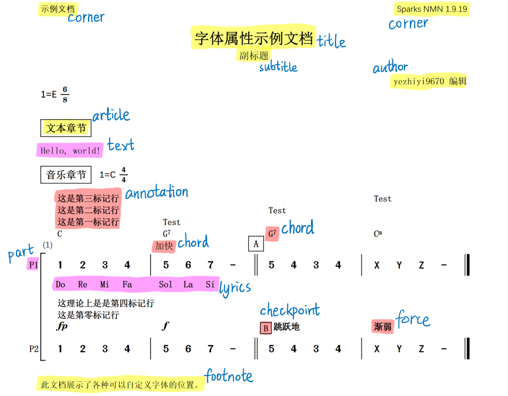

import C from '@site/src/mdx'
import * as Cr from '@site/src/mdx/reference/renderprops'

# 自定义字体 {#custom-fonts}

Sparks NMN 中的部分内容（并不是所有）可以自行选择字体，以提供更好的个性化选择。控制字体的渲染属性名称均以 `font_` 开头。

## 所有字体选项 {#all-font-options}

<Cr.RenderPropsReference filters={['font']} />

## 字体选项的格式 {#font-option-format}

为了方便表示字体粗细以及大小，字体选项采用特殊的格式，形如 `<名称>/<粗细>/<大小>`。

- 名称为系统中的字体名称，可以选择中文或英文名。**如果名称中有空格，应当使用下划线 `_` 代替**，原来的下划线使用双下划线 `__` 代替。
- 字体名称可以是多个字体，使用逗号 `,` 隔开，例如 `Roman,CommonSerif`。**注意逗号后不能有空格**。
- 粗细数值使用 CSS 标准，正常为 `400`，加粗为 `700`。部分字体可以自由选择其他数值，实现更精细的控制。
- 大小指的是相对默认尺寸的大小。若要获得默认大小应当设置为 `1`。
- 大小、粗细的默认值分别是 `1` 和 `400`，若要取默认值，可以依次省略，例如 `CommonSerif/600` 表示字重 `600` 的宋体，大小为 `1`。

:::info 提示

你的字体名称里有两个连续的空格？那恐怕是没救了，自己想办法改一下吧。

:::

import FontInfo from '../_common/font-info.mdx'

<FontInfo />

## 自定义字体的位置 {#font-options-intro}

我们将所有能够自定义字体的元素放到一份文档中，以方便你进行尝试。

<C.ScoreExample canLoad children={
`// highlight-next-line
Rp: font_title=Roman,CommonSerif/700/1
///////////////////////
Dp: 示例文档
Dv: Sparks NMN 1.9.19
Dt: 字体属性示例文档
Ds: 副标题
Da[编辑]: yezhiyi9670
P: 1=E 6/8
Df: 此文档展示了各种可以自定义字体的位置。
====
S: 文本章节
T: Hello, world!
====
S: 音乐章节
Sp: 1=C 4/4
---
N["P1"]: 1 2 3 4 |{"加快"} 5 6 7 - ||["A"] 5 4 3 4 | X Y Z - |||
A: c"C" | c"G7" | c"G7" | c"Cm" |
A: "这是第一标记行" | "Test"
A: "这是第二标记行" | 0 | "Test"
A: "这是第三标记行" | 0 | 0 | "Test"
Lw: Do Re Mi Fa Sol La Ti
N["P2"]: 1 2 3 4 | 5 6 7 - ||{[B], *} 5 4 3 4 | X Y Z - |||
A: fp | f | r"  跳跃地" | r"渐弱" |
A[0]: "这是第零标记行"
A[4]: "这理论上是是第四标记行"
`
} />

## 接下来... {#next}

接下来，我们将介绍对音乐部分的精细控制——包括控制乐谱分行的位置、调整小节的宽度以及上边距。
